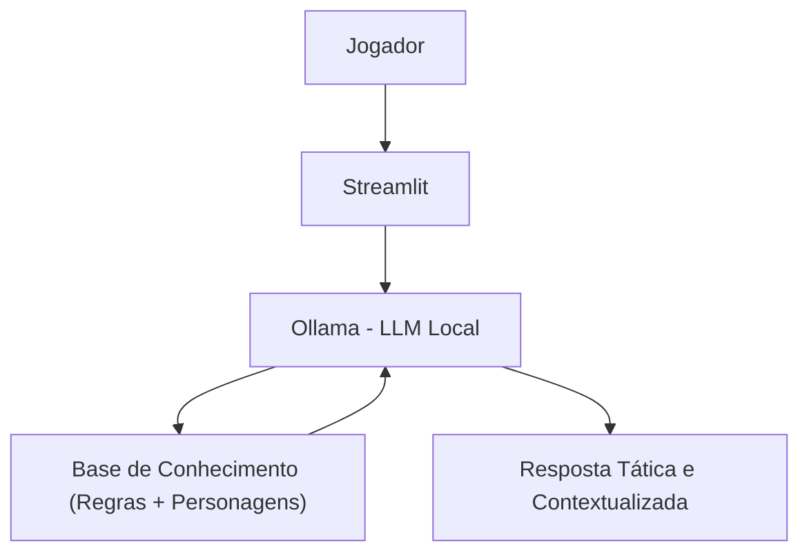

# 🎲 Aslan - Consultor de RPG de Mesa Inteligente

> Agente de IA Generativa especializado em RPG de mesa, focado em criação de personagens, otimização de builds e interpretação de regras de forma clara, contextualizada e baseada em dados do jogador.

---

## 💡 O Que é o Arkan?

O Aslan é um assistente inteligente para jogadores e mestres de RPG de mesa. Ele **não joga por você**, mas ajuda a entender regras, criar personagens mais eficientes e explorar combinações de classes, talentos e habilidades.

Ele utiliza dados do próprio jogador e de seus personagens para fornecer sugestões personalizadas e explicações contextualizadas.

### O que o Aslan faz:
- ✅ Explica regras de RPG de mesa de forma simples e clara
- ✅ Auxilia na criação e otimização de personagens
- ✅ Sugere builds baseadas em sinergia de classes, talentos e atributos
- ✅ Analisa personagens existentes e aponta melhorias
- ✅ Ajuda a interpretar mecânicas de combate, magia e progressão

### O que o Aslan NÃO faz:
- ❌ Não inventa regras oficiais
- ❌ Não decide ações por jogadores ou mestres
- ❌ Não substitui o mestre da campanha
- ❌ Não garante uma “build perfeita” ou absoluta
- ❌ Não responde perguntas fora do universo de RPG de mesa

---

## 🏗️ Arquitetura


---
-Interface: Streamlit

-LLM: Ollama (modelo local gpt-oss)

-Dados: JSON/CSV com regras, personagens e histórico de sessões

## Estrutura do Projeto
```
├── data/                          # Base de conhecimento RPG
│   ├── perfil_jogador.json        # Perfil do jogador
│   ├── personagens.csv            # Personagens criados
│   ├── historico_sessoes.csv      # Dúvidas e interações anteriores
│   └── conteudo_regras.json       # Regras, classes, talentos e magias
│
├── docs/                          # Documentação completa
│   ├── 01-documentacao-agente.md  # Caso de uso e persona
│   ├── 02-base-conhecimento.md    # Estratégia de dados
│   ├── 03-prompts.md              # System prompt e exemplos
│   ├── 04-metricas.md             # Avaliação de qualidade
│   └── 05-pitch.md                # Apresentação do projeto
│
└── src/
    └── app.py                     # Aplicação Streamlit
```
